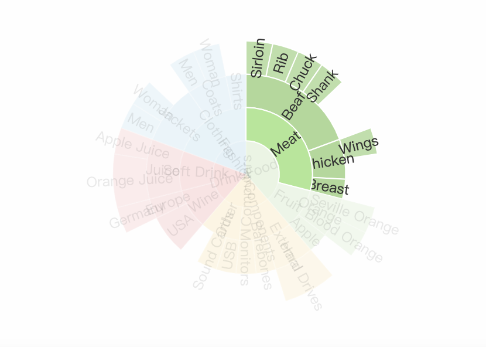

设计方向

# Echarts

[官网：事件的处理](https://echarts.apache.org/handbook/zh/concepts/event/#%E9%BC%A0%E6%A0%87%E4%BA%8B%E4%BB%B6%E7%9A%84%E5%A4%84%E7%90%86)

## 1. 饼图类似设计，点击后可以扩展的

[https://echarts.apache.org/zh/option.html#series-sunburst.nodeClick](https://echarts.apache.org/zh/option.html#series-sunburst.nodeClick)
   

## 2. 交互性设计，可以看下这篇CSDN

[https://blog.csdn.net/weixin_43239880/article/details/123096344](https://blog.csdn.net/weixin_43239880/article/details/123096344)

## 3. D3图

[https://d3js.org/](https://d3js.org/)

## 4. roc-chart

这个是开源的关系图谱的一个js库，适用于react
官网： 